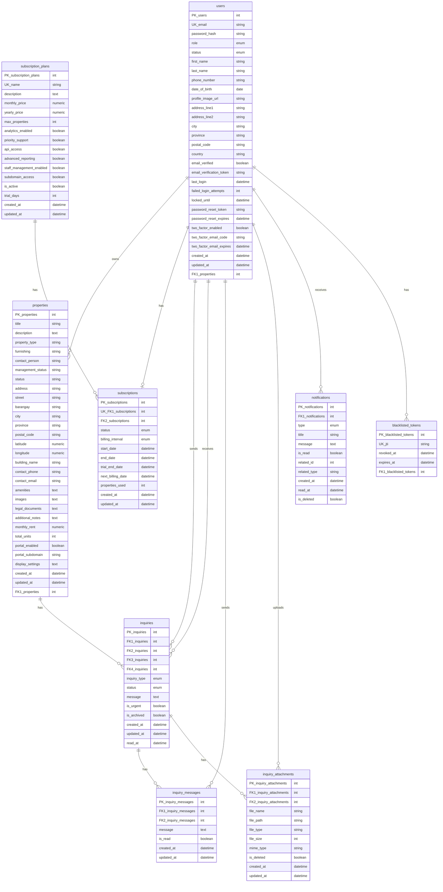

# Database Entity Relationship Diagram (ERD)

This document contains the complete Entity Relationship Diagram for both the main-domain and sub-domain databases.

## Main Domain Database ERD

## Sub Domain Database ERD

```mermaid
erDiagram
    users ||--o| tenants : "has_profile"
    users ||--o| staff : "has_profile"
    users ||--o{ properties : "owns"
    users ||--o{ units : "manages"
    users ||--o{ tasks : "creates"
    users ||--o{ tasks : "assigned_to"
    users ||--o{ payments : "processes"
    users ||--o{ payments : "verifies"
    users ||--o{ documents : "uploads"
    users ||--o{ messages : "sends"
    users ||--o{ notifications : "receives"
    users ||--o{ announcements : "publishes"
    users ||--o{ feedback : "submits"
    
    properties ||--o{ units : "has"
    properties ||--o{ tenants : "has"
    properties ||--o{ staff : "has"
    properties ||--o{ maintenance_requests : "has"
    properties ||--o{ documents : "has"
    properties ||--o{ chats : "has"
    properties ||--o{ announcements : "has"
    properties ||--o{ feedback : "has"
    
    tenants ||--o{ tenant_units : "has"
    tenants ||--o{ bills : "has"
    tenants ||--o{ maintenance_requests : "creates"
    tenants ||--o{ chats : "has"
    tenants ||--o{ notifications : "receives"
    
    units ||--o{ tenant_units : "has"
    units ||--o{ bills : "has"
    units ||--o{ maintenance_requests : "has"
    units ||--o{ tasks : "has"
    
    tenant_units ||--o{ bills : "generates"
    
    staff ||--o{ maintenance_requests : "assigned_to"
    staff ||--o{ tasks : "assigned_to"
    
    bills ||--o{ payments : "has"
    
    chats ||--o{ messages : "has"
    
    users {
        PK_users int
        UK_email string
        UK_username string
        password_hash string
        first_name string
        last_name string
        phone_number string
        date_of_birth date
        role enum
        is_active boolean
        email_verified boolean
        created_at datetime
        updated_at datetime
        last_login datetime
        password_reset_token string
        password_reset_expires datetime
        avatar_url string
        address text
        emergency_contact_name string
        emergency_contact_phone string
        two_factor_enabled boolean
        two_factor_email_code string
        two_factor_email_expires datetime
    }
    
    properties {
        PK_properties int
        title string
        description text
        property_type string
        furnishing string
        management_status string
        status string
        total_units int
        address string
        city string
        province string
        building_name string
        contact_person string
        contact_phone string
        contact_email string
        monthly_rent numeric
        amenities text
        images text
        legal_documents text
        additional_notes text
        portal_enabled boolean
        portal_subdomain string
        display_settings text
        created_at datetime
        updated_at datetime
        FK1_properties int
    }
    
    units {
        PK_units int
        FK1_units int
        unit_name string
        bedrooms int
        bathrooms enum
        size_sqm int
        monthly_rent numeric
        security_deposit numeric
        status string
        description text
        floor_number string
        parking_spaces int
        images text
        inquiries_count int
        amenities text
        created_at datetime
        updated_at datetime
    }
    
    tenants {
        PK_tenants int
        FK1_tenants int
        FK2_tenants int
        phone_number string
        email string
        created_at datetime
        updated_at datetime
    }
    
    tenant_units {
        PK_tenant_units int
        FK1_tenant_units int
        FK2_tenant_units int
        rent_start_date date
        rent_end_date date
        monthly_rent numeric
        security_deposit numeric
        rent_status enum
        is_active boolean
        move_in_date date
        move_out_date date
        move_in_inspection_notes text
        move_out_inspection_notes text
        deposit_returned boolean
        deposit_return_amount numeric
        deposit_return_date date
        renewal_offered boolean
        renewal_accepted boolean
        renewal_date datetime
        notice_given boolean
        notice_date date
        termination_reason string
        created_at datetime
        updated_at datetime
    }
    
    staff {
        PK_staff int
        FK1_staff int
        UK_employee_id string
        staff_role string
        FK2_staff int
        created_at datetime
        updated_at datetime
    }
    
    tasks {
        PK_tasks int
        title string
        description text
        priority string
        status string
        FK1_tasks int
        FK2_tasks int
        FK3_tasks int
        FK4_tasks int
        due_date datetime
        completed_at datetime
        notes text
        created_at datetime
        updated_at datetime
    }
    
    bills {
        PK_bills int
        UK_bill_number string
        FK1_bills int
        FK2_bills int
        bill_type string
        title string
        description text
        amount numeric
        bill_date date
        due_date date
        period_start date
        period_end date
        status string
        is_recurring boolean
        recurring_frequency string
        is_auto_generated boolean
        paid_date date
        payment_confirmation_number string
        notes text
        created_at datetime
        updated_at datetime
    }
    
    payments {
        PK_payments int
        FK1_payments int
        amount numeric
        payment_method string
        status string
        payment_date date
        reference_number string
        transaction_id string
        confirmation_number string
        proof_of_payment text
        remarks text
        FK2_payments int
        FK3_payments int
        verified_at datetime
        notes text
        receipt_url string
        created_at datetime
        updated_at datetime
    }
    
    maintenance_requests {
        PK_maintenance_requests int
        UK_request_number string
        FK1_maintenance_requests int
        FK2_maintenance_requests int
        FK3_maintenance_requests int
        FK4_maintenance_requests int
        title string
        description text
        category string
        priority string
        status string
        scheduled_date datetime
        estimated_completion datetime
        actual_completion datetime
        work_notes text
        resolution_notes text
        tenant_satisfaction_rating int
        tenant_feedback text
        images text
        attachments text
        created_at datetime
        updated_at datetime
    }
    
    documents {
        PK_documents int
        title string
        filename string
        file_path string
        document_type string
        FK1_documents int
        FK2_documents int
        visibility string
        created_at datetime
    }
    
    chats {
        PK_chats int
        FK1_chats int
        FK2_chats int
        subject string
        status string
        last_message_at datetime
        created_at datetime
        updated_at datetime
    }
    
    messages {
        PK_messages int
        FK1_messages int
        FK2_messages int
        sender_type string
        content text
        is_read boolean
        read_at datetime
        created_at datetime
        updated_at datetime
    }
    
    notifications {
        PK_notifications int
        FK1_notifications int
        FK2_notifications int
        recipient_type string
        notification_type string
        priority string
        title string
        message text
        related_entity_type string
        related_entity_id int
        is_read boolean
        read_at datetime
        action_url string
        created_at datetime
        updated_at datetime
    }
    
    announcements {
        PK_announcements int
        title string
        content text
        announcement_type string
        priority string
        FK1_announcements int
        FK2_announcements int
        is_published boolean
        created_at datetime
    }
    
    feedback {
        PK_feedback int
        subject string
        message text
        feedback_type string
        rating int
        FK1_feedback int
        FK2_feedback int
        status string
        created_at datetime
    }
```

## Relationship Summary

### Main Domain Relationships:
1. **User → Properties**: One-to-Many (user owns multiple properties)
2. **User → Subscriptions**: One-to-One (user has one subscription)
3. **Subscription Plan → Subscriptions**: One-to-Many (plan has many subscriptions)
4. **User → Inquiries**: One-to-Many (user sends/receives inquiries)
5. **Property → Inquiries**: One-to-Many (property has many inquiries)
6. **Inquiry → Inquiry Messages**: One-to-Many (inquiry has many messages)
7. **Inquiry → Inquiry Attachments**: One-to-Many (inquiry has many attachments)
8. **User → Notifications**: One-to-Many (user receives many notifications)
9. **User → Blacklisted Tokens**: One-to-Many (user has many blacklisted tokens)

### Sub Domain Relationships:
1. **User → Tenant/Staff**: One-to-One (user has one tenant or staff profile)
2. **Property → Units**: One-to-Many (property has many units)
3. **Property → Tenants**: One-to-Many (property has many tenants)
4. **Property → Staff**: One-to-Many (property has many staff members)
5. **Tenant → Tenant Units**: One-to-Many (tenant has many unit assignments)
6. **Unit → Tenant Units**: One-to-Many (unit has many tenant assignments)
7. **Tenant → Bills**: One-to-Many (tenant has many bills)
8. **Unit → Bills**: One-to-Many (unit has many bills)
9. **Bill → Payments**: One-to-Many (bill has many payments)
10. **Tenant → Maintenance Requests**: One-to-Many (tenant creates many requests)
11. **Staff → Maintenance Requests**: One-to-Many (staff assigned to many requests)
12. **Property → Documents**: One-to-Many (property has many documents)
13. **Tenant → Chats**: One-to-Many (tenant has many chats)
14. **Property → Chats**: One-to-Many (property has many chats)
15. **Chat → Messages**: One-to-Many (chat has many messages)
16. **User → Tasks**: One-to-Many (user creates/assigned to many tasks)
17. **Property → Announcements**: One-to-Many (property has many announcements)
18. **Property → Feedback**: One-to-Many (property has many feedback entries)

## Notes

- **Main Domain**: Focuses on property listings, inquiries, subscriptions, and user management
- **Sub Domain**: Focuses on property management operations including tenant management, billing, maintenance, staff, and communication
- Both domains share the `users` table structure but serve different purposes
- **Format**: Primary keys use `PK_(Entity name) (Datatype)` format (e.g., PK_users int)
- **Format**: Foreign keys use `FK1_(Entity name) (Datatype)`, `FK2_(Entity name) (Datatype)`, etc. (e.g., FK1_properties int)
- **Format**: Unique keys use `UK_(Field name) (Datatype)` format (e.g., UK_email string)

