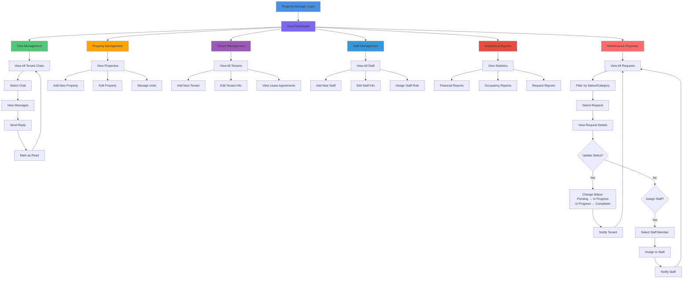
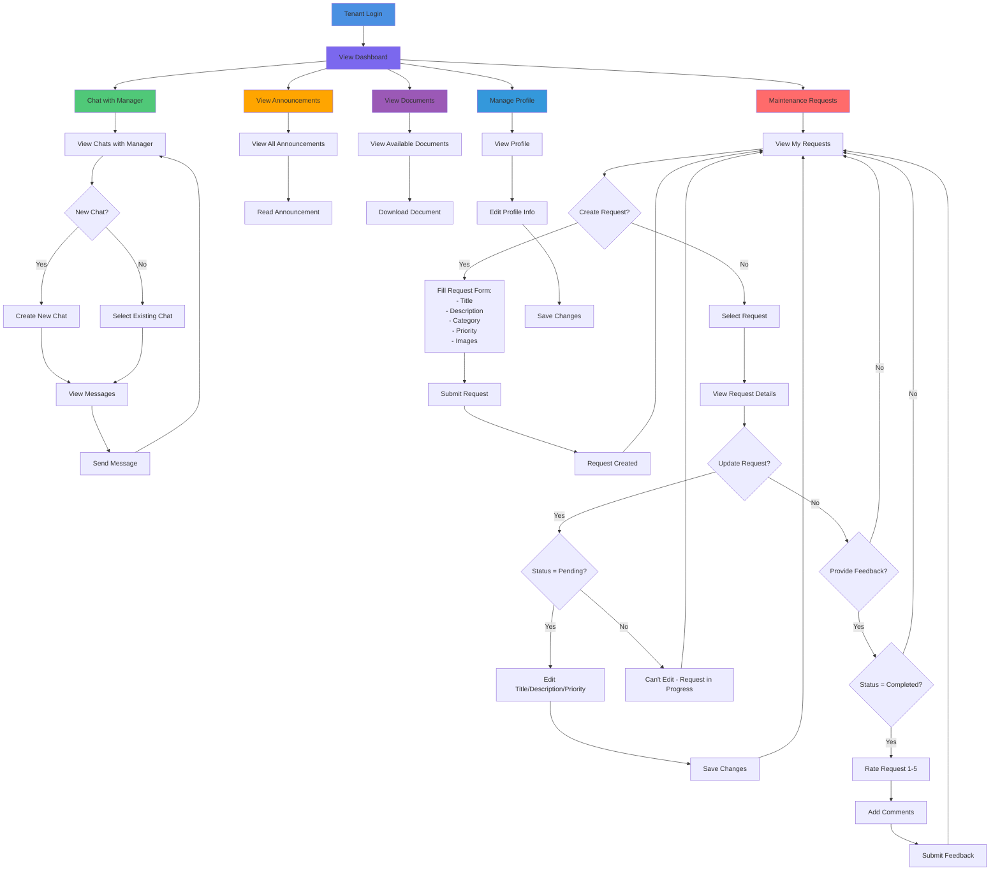
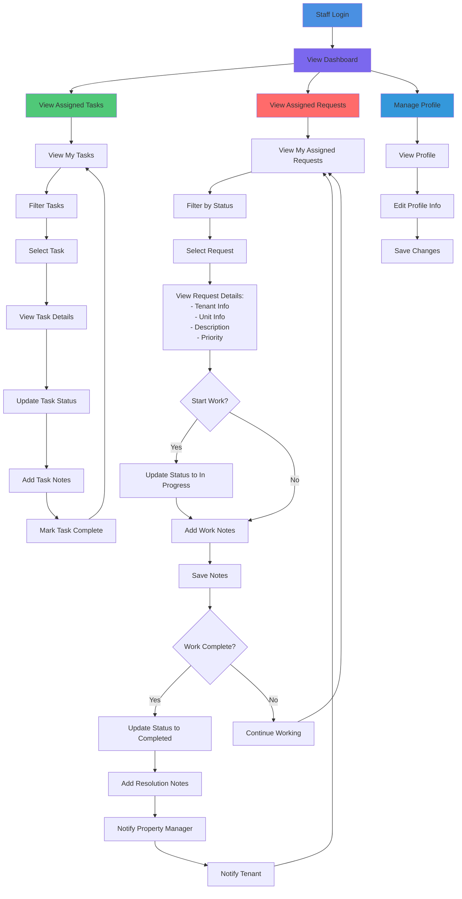
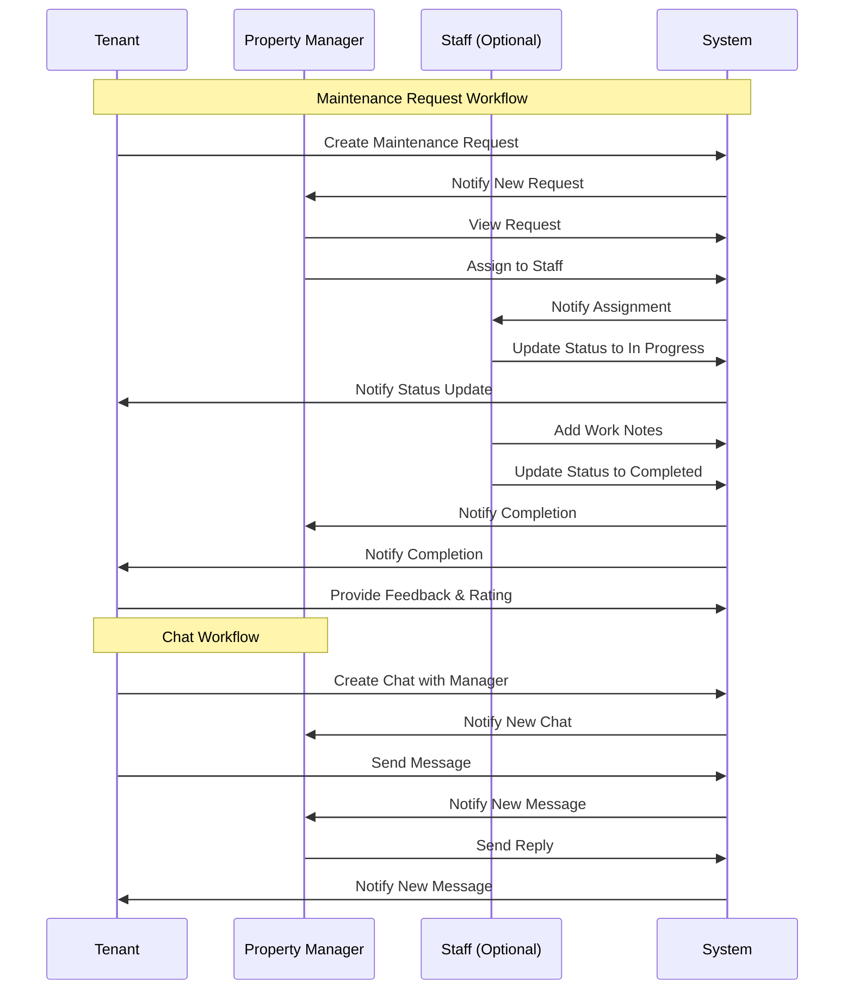

# Program Workflow Diagram

## System Overview
This document outlines the workflow diagrams for the JACS Property Management Platform, separated by user roles: Property Manager, Tenants, and Staff (Optional).

---

## 1. Property Manager Workflow

---

## 2. Tenant Workflow

---

## 3. Staff Workflow (Optional)

---

## 4. Cross-Role Interaction Flow

---

## 5. System Features Summary

### Property Manager Features
- ✅ Chat Management (View/Reply to tenant chats)
- ✅ Maintenance Request Management (View/Update/Assign)
- ✅ Property Management (CRUD operations)
- ✅ Tenant Management (View/Add/Edit tenants)
- ✅ Staff Management (View/Add/Edit staff)
- ✅ Analytics & Reports (Financial, Occupancy, Requests)
- ✅ Announcement Management
- ✅ Document Management

### Tenant Features
- ✅ Chat with Property Manager (Create/View/Send messages)
- ✅ Maintenance Request Management (Create/View/Update/Delete pending requests)
- ✅ Request Feedback (Rate and comment on completed requests)
- ✅ View Announcements
- ✅ View Documents
- ✅ Profile Management

### Staff Features (Optional)
- ✅ View Assigned Maintenance Requests
- ✅ Update Request Status
- ✅ Add Work Notes
- ✅ Add Resolution Notes
- ✅ View Assigned Tasks
- ✅ Update Task Status
- ✅ Profile Management

---

## 6. Key Workflow States

### Maintenance Request States
1. **Pending** - Initial state when tenant creates request
2. **In Progress** - When staff starts working on request
3. **Completed** - When work is finished
4. **Cancelled** - When request is cancelled
5. **On Hold** - When work is temporarily paused

### Chat States
1. **Active** - Ongoing conversation
2. **Archived** - Archived conversation
3. **Closed** - Closed conversation

### User Roles
- **MANAGER** - Property Manager (full access to property operations)
- **TENANT** - Tenant (limited to own data)
- **STAFF** - Staff member (access to assigned tasks/requests)

---

## Notes
- All workflows require JWT authentication
- Property isolation is enforced (tenants can only see their property's data)
- Real-time notifications are sent for important events
- Staff role is optional and can be enabled/disabled per property

